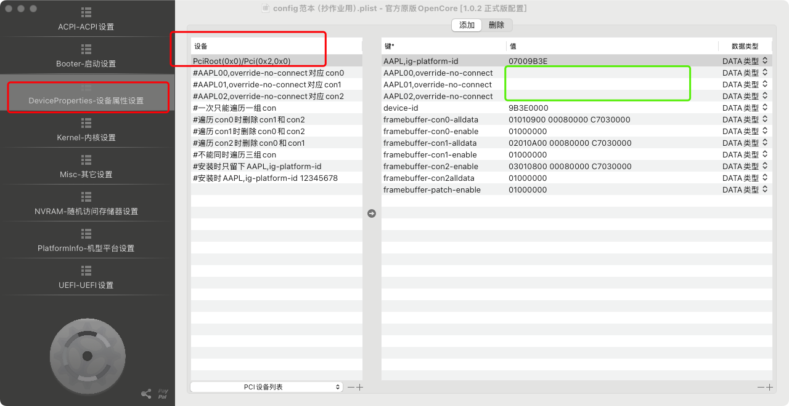
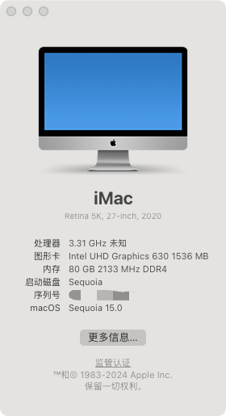
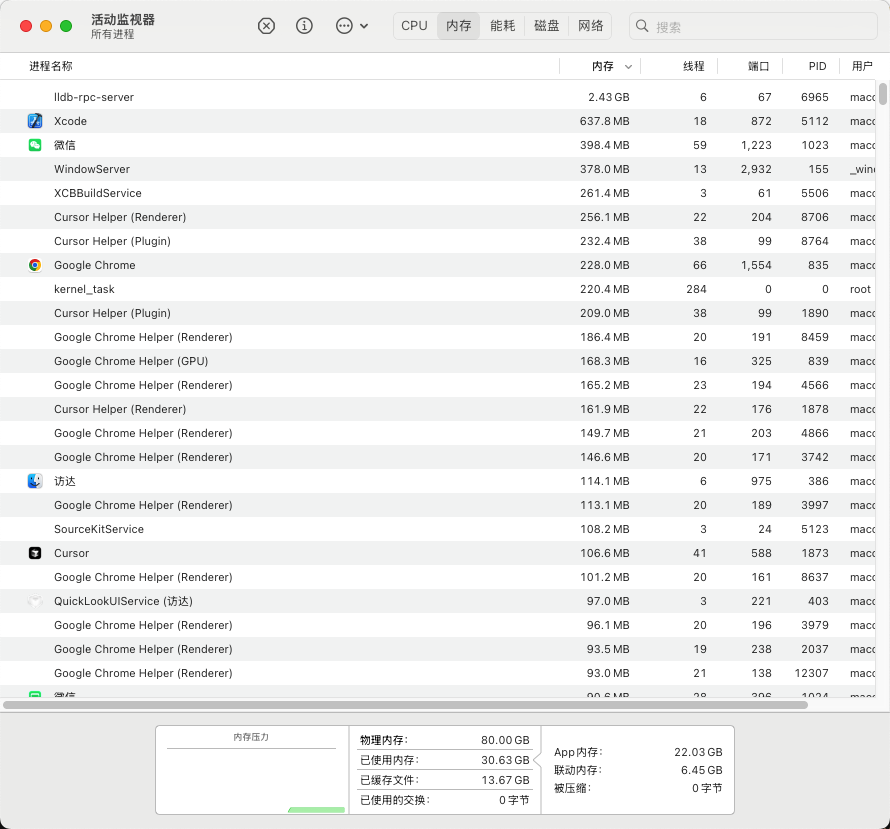

# Hackintosh-Z590-P-i9-10900KES-UHD630

## 硬件配置

- 主板：七彩虹Z590
- 处理器：i9-10900KES = QTB2
- 内存：DDR4 2933 32GB*2 + DDR4 2933 16GB*1
- 显卡：Intel UHD Graphics 630
- 硬盘：AEPC1920P5xnNTLC 1.92TB

### 注意以下步骤均在 windows 系统下操作
## 安装步骤一 将Macos镜像文件写入硬盘：

1. 使用工具将硬盘分区，设置 efi 分区300-500MB，其余空间为macos安装分区
2. 下载RDriveImage7 windows文件，安装并将原生的 rdr 文件写入硬盘

## 安装步骤二 生成基础 EFI 文件：

1. 下载[RapidEFI](https://github.com/JeoJay127/RapidEFI-Tool/releases)
2. 配置基础配置文件，可以通过无限卡模式进入登录页面

## 安装步骤三 集成显卡驱动：
1. 使用MonitorAsset manager 2.9 版本，查看当前显示器信息,一般均为第一个选项，可以查看到很多显示器信息
2. 下拉到第一选项最后一栏，有二进制信息，将二进制信息复制并清除逗号和换行符号得到准确显示器信息
3  使用OCAT-win64 文件工具 将原本的 config.plist打开，修改如图的数据，将显示器 16 进制信息复制到绿色框内，进行调试
4  注意 AAPL00 代表一个显示器，如果增加多个可能会导致有多个显示器选项，最好多测试验证  
5  将 config.plist 文件保存，并替换到 EFI 文件夹内

## 完成好后如图

